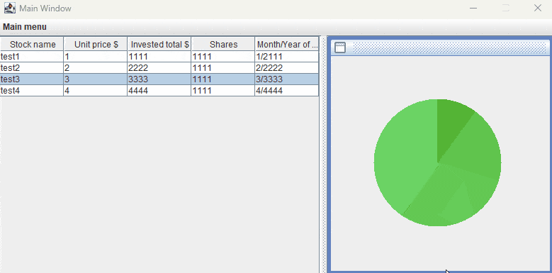
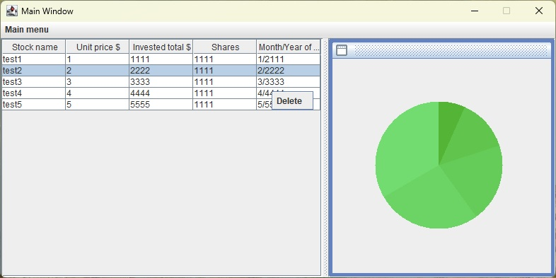
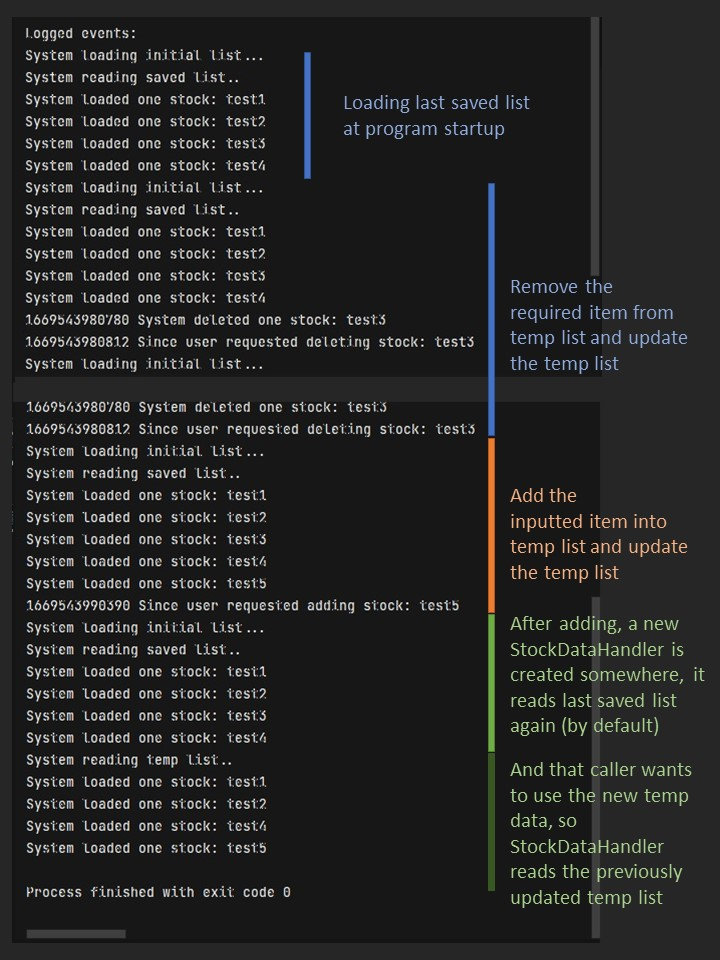

# Personal Project - Idea

**Stock portfolio pie charts**

Basic goals proposal:
- What will the application do? It takes inputs of stock investment data from a user, and plots pie charts for data visualization and organizing.
- Who will use it? People with a few stocks in their portfolio and want to better visualize them for future decisions.
- Why is this project of interest to you? I have some investment in low-risk funds, and occasionally have need to visualize my portfolio. A lot of stock apps can do similar things and much more, but it is nice to know whether I can get a start at doing such things too.

User stories:
- As a user, I want to be able to **input** an arbitrary number of my invested stocks (X) into a list (Y).
- As a user, I want to input data about those items, including: **name**, **invested money**, **price**.
- As a user, I want to be able to **delete** those items.
- As a user, I want to be able to **update** those items, such as: change prices or invested money on it.
- As a user, I need to see a **list** of stocks with their info in each row, or something like that.
- As a user, I want to save inputted stock info items in a file on hard drive.
- As a user, I want to load the file I saved last time.
- *(Stretch goal)* As a user, I may want to see pie charts for 2-3 months juxtaposed together for comparison.
- *(Stretch goal)* As a user, I may want to see an alternate chart of the same month, but with stocks categorized by sectors.

## Instructions for Grader
- You can generate the first required event related to adding Xs to a Y by: Main menu -> Add new stock. 
- You can generate the second required event related to adding Xs to a Y by: right-click on a row -> Delete.    *(Currently right-click does not select a row. Sorry about that.)*
- You can locate my visual component by: looking at the right side of the window, where there is pie chart graphics.
- You can save the state of my application by: Main menu -> Save to file. *(Currently there is no GUI for successful saving. Sorry about that.)*
- You can reload the state of my application by: Main menu -> Load last saved.

## Phase 4: Task 2
Here is a sample log printed at program exit.
Actions performed in this sample test are:
- Open program
- Delete a stock (event 1 in Phase 3)
- Add a stock (event 2 in Phase 3)
- Exit program
 